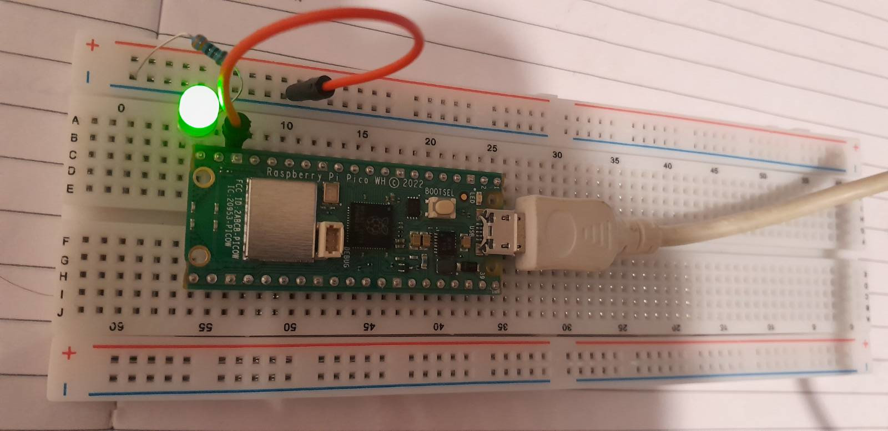

# Raspberry Pi Pico FreeRTOS Starter

The purpose of this project is to provide a starter project
of how to use FreeRTOS on Raspberry Pi Pico boards.

It simply starts a freeRTOS task to flash an LED.

Connect the LED to GPIO port 15 in series with a 330R resistor and it will flash at 1Hz.



- The simplest way to customize the build is to use the VS Code extension for the
Pico SDK. The extension provides an interface to quickly reconfigure CMake for
different boards.

- The project uses the forked version of the FreeRTOS Kernel provided by
Raspberry Pi.

## Board Support

This project should work out-of-the-box for the following boards.

- Raspberry Pi Pico
- Raspberry Pi Pico W (currently set to his in `CMakeLists.txt`)
- Raspberry Pi Pico 2
- Raspberry Pi Pico 2W

Modify this line in `CMakeLists.txt` for other board types:
```
set(PICO_BOARD pico_w CACHE STRING "Board type")
```

## Requirements

1. CMake 3.20 or later, gcc ARM cross compiler

```bash
sudo apt update && sudo apt install -y cmake gcc-arm-none-eabi libnewlib-arm-none-eabi build-essential git
```

2. Raspberry Pi Pico C SDK

Create a subdirectory `pico` as a workspace which contains both this project and the pico SDK.

```bash
mkdir -p ~/pico && cd ~/pico
git clone https://github.com/raspberrypi/pico-sdk.git
cd pico-sdk
git checkout tags/2.2.0 -b sdk2.2.0
git submodule update --init
```

## Building and installation

1. Update the submodules to clone the FreeRTOS kernel

```shell
$ git submodule update --init FreeRTOS
```

2. Use `CMake` and `make` to build it:

```shell
cmake .
make
```

> On Windows, use the Ninja generator from CMake.
> `cmake -B . -G Ninja`

3. Installation on the Pico:

Hold the boot button on the pico while plugging it in to your
computer.  Install `pico-freertos-starter.uf2` by copying it to the
Pico's mass storage drive.

## Reference

Check out the [FreeRTOS Kernel Book](https://github.com/FreeRTOS/FreeRTOS-Kernel-Book/blob/main/toc.md)
to learn more about FreeRTOS and waht it offers.
