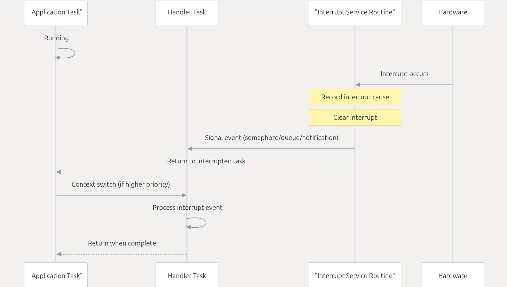

# freeRTOS Raspberry Pi Pico demo: an interrupt and a task changing a state

The purpose of this project is twofold:
 1. to provide a skeleton project of how to use freeRTOS on Raspberry Pi Pico boards.
 2. to demonstrate a classical RT example: a short/deterministic *interrupt* triggers a non-deterministic *slow task* 
    changing a *state machine*. In this example a pushbutton switches on an LED and 
    switches it automatically off 1sec later.
    States are key for realtime processing which are changed by external events and internal ones.
	

Figure [from](https://deepwiki.com/FreeRTOS/FreeRTOS-Kernel-Book/2.7-interrupt-management) (CC BY-SA 4.0) and
see https://www.freertos.org/Documentation/02-Kernel/02-Kernel-features/11-Deferred-interrupt-handling for a
detailed description of deferred interrupt handling with tasks.

## Hardware setup

 1. Connect an LED to GPIO port 15 in series with a 330R resistor to GND.
 2. Connect a pushbutton between port 15 and GND.


## Board Support

This project should work out-of-the-box for the following boards:

- Raspberry Pi Pico
- Raspberry Pi Pico W (currently set to his in `CMakeLists.txt`)

Modify this line in `CMakeLists.txt` for other board types:
```
set(PICO_BOARD pico_w CACHE STRING "Board type")
```

## Requirements

1. CMake 3.20 or later, gcc ARM cross compiler

```bash
sudo apt update && sudo apt install -y cmake gcc-arm-none-eabi libnewlib-arm-none-eabi build-essential git
```

2. Raspberry Pi Pico C SDK

Create a subdirectory `pico` as a workspace which contains both this project and the pico SDK.

```bash
mkdir -p ~/pico && cd ~/pico
git clone https://github.com/raspberrypi/pico-sdk.git
cd pico-sdk
git checkout tags/2.2.0 -b sdk2.2.0
git submodule update --init
```

## Building and installation

1. Update the submodules to clone the FreeRTOS kernel

```shell
$ git submodule update --init FreeRTOS
```

2. Use `CMake` and `make` to build it:

```shell
cmake .
make
```

3. Installation on the Pico:

Hold the boot button on the pico while plugging it in to your
computer.  Install `pico-freertos-starter.uf2` by copying it to the
Pico's mass storage drive.

## Reference

Check out the [FreeRTOS Kernel Book](https://github.com/FreeRTOS/FreeRTOS-Kernel-Book/blob/main/toc.md)
to learn more about FreeRTOS and waht it offers.
